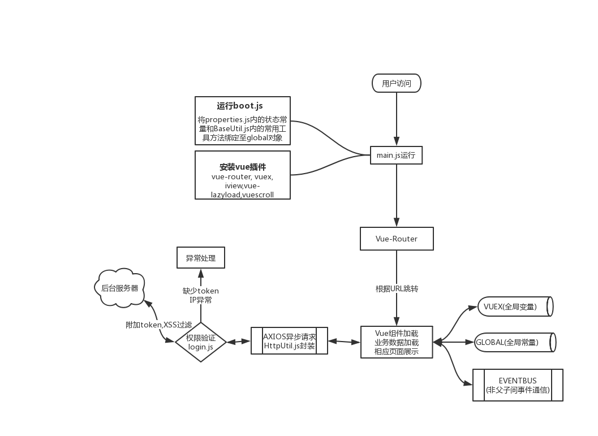

# MyIona-Vue

<a title="Hits" target="_blank" href="https://github.com/b3log/hits"></a>

## 简介

[MyIona项目](https://github.com/zazaluMonster/MyIona)的VUE前端项目

技术 | 工具
----|------
MVVM框架 | vue@2.6.10
VUE组件库 | iView@3.4.2
全局状态仓库 | vuex@3.0.1
路由管理 | vue-router@3.0.3
脚手架工具 | vue-cli@3.8.4
HttpClient | axios@0.19.0
XSS过滤 | xss@1.0.6
MD5加密 | md5@2.2.1
WebSocket | sockjs-client@1.3.0
WebSocket | stompjs@2.3.3
富文本编辑器 | wangeditor@3.1.1
图片懒加载 | vue-lazyload@1.3.1

其他还有很多很多框架工具，感谢你们

## 运行流程图



## 安装

1. 使用`git clone`或者下载zip包来先将项目全部内容拷贝至本地
2. 在项目根目录下执行`npm install`，来加载本项目用到的node模块

**[note]**: git，nodejs，npm请自行安装

## 运行


1. 执行以下命令

```
npm run serve
```

它会进行"编译"，然后打开一个node服务器来运行我们的myionavue，默认监听端口是8089，你可以在`package.json`中修改端口，如下
```
  "scripts": {
    "serve": "vue-cli-service serve --port 8089",  //修改你喜欢的端口
```

2. 一切正常的话，你系统的默认浏览器会被打开并展示myionavue的登录页面，但是无法登录，需要有后台支持

3. 默认开启DEBUG模式，会打印相当多的日志，可在`properties.js`中关闭，将`DEBUG`改为`false`即可

## 导出dist

```
npm run build
```

## 项目部分技术要点说明

### 状态管理

>巧用了global全局对象

所有的常量properties和常用工具函数BaseUtil都通过`boot.js`注册在Node的全局对象`global`中

1. `global.$prop`访问全部properties
2. `global.$util`访问常用工具(部分特定的工具，比如HttpUtil，使用import来导入使用，请不要挂载在global中)

>官方状态管理工具vuex

一些在运行时会经常改变的变量，使用vuex进行了管理，比如头像url或者当前登录用户数据

vuex保证了vue的数据的响应式不会失效，是vue开发中状态管理的利器

1. 查看`store.js`可以看到vuex的详细配置
2. 使用`this.$store.state.xxx`来获取任何vuex仓库中的数据
3. 使用`vuexStore.commit("xxx", xxx);`来更新状态变量才能触发vue的响应式更新

### 路由管理

SPA应用将原本后台管理的路由配置转到了前端js进行管理，当我们请求SPA应用的唯一html文件，加载vue.js后，vue-router便开始了路由管理的工作.

我们可以通过vue-router来跳转到不同的url地址，并加载与url地址绑定的vue组件，各个不同url路径下便可以根据router配置展现出不同的vue组件，从而让我们“感觉”页面在跳转，然而实际上那只是各个vue组件的创建的销毁，我们访问的仍然只是那个最初的html文件

1. 查看`router.js`课可以看到router的详细配置
2. 使用`router.push(xxx);`等编程式跳转接口，可以控制router的跳转
3. 使用`global.$util.routerPush`等我封装的方法，可以直接在任意位置使用router的编程式接口，而不必每次都import

**[注意]**: 建议使用router的懒加载方式`component: () => import('./xxx.vue')`来减少一口气加载vue组件的系统开销，加速首次访问

### 事件EventBus

本项目使用了EventBus的设计来方便非父子组件之间的通信，具体可以见[此博文](https://medium.com/@andrejsabrickis/https-medium-com-andrejsabrickis-create-simple-eventbus-to-communicate-between-vue-js-components-cdc11cd59860)

### 异步ajax请求-axios

前端的数据来源都使用axios发起的http请求获取，本项目统一使用了post请求(少量get)来请求各种数据，所以对axios进行了一定的包装，来方便对程序进行统一的管理。`httpUtil.js`就是我封装axios的工具，其生产了全局的一个axios实例和一个包含各类钩子函数的post请求方法。

1. 全局使用同一个axios实例方便我对http报文和http配置进行统一的设置，比如超时时间，后台报错统一处理等
2. 同时也提供了各类钩子函数，为不同的场景提供一些自定义处理服务，比如在post请求发送前，发送后，处理返回数据，异常发生的处理函数等等

由于本工具的内容比较多，且并不是任何vue组件都需要用到(比如一些子组件的数据都来自父组件，所以不需要用到http工具)，所以并没有挂靠到`global`属性上，可以通过`import`来单独使用

1. 引入`import { post } from "@/util/httpUtil.js";`
2. 使用`post(url,data,callback)`来发起请求，有关api可以查阅`httpUtil.js`

**[注意]**: 测试时，前后端往往是两个服务器分开跑的，前端跑在nodejs上，后端跑在tomcat上，所以请注意的跨域访问

### 会话管理(权限验证)

本项目结合cookie，token实现了一个简单的会话管理(分后台验证和前台)

> 前端验证

每次登录成功后，都会像当前path下创建以下cookie来保存当前用户token
1. `MyIonaCrewName` => 保存了用户名(唯一)
2. `${MyIonaCrewName}_token` => 保存了登录后后台返回的token，一串唯一的凭证数据
3. 每次发送http请求时，会调用`fontLoginAuth`方法，先进行一次简单前端的验证，查看token是否存在，这样可以减少往后台发送请求的次数
4. 拥有token凭证后，每次将token注入在http报文头的`Authorization`中，供后台验证

> 后台验证

具体细节移步[MyIona后台](https://github.com/zazaluMonster/MyIona)

这里只简单的提下流程

后台接受到前端的token后，拦截器会检查内存缓存(Ehcache或者Redis,目前是Ehcache)中是否存在，若存在则放行, 若不存在则返回一个特定的状态，供前端辨识后跳转回首页

> 其他风险处理(TODO)

当token不小心泄露给其他人，并且其他人了解了本系统的cookie存储规则后，正常的流程已无法阻止冒充他人身份登录的行为。
不过幸运的是，每次后台不仅存储了当前用户的token，同时也关联存储了该token最近一次的访问ip，当检测到ip变动的时候，不管token是否匹配，都会触发一次`风险警告`，并由router重定向到登录页面，要求重新输入密码

### 其余要点

> WebSocket

使用`sockjs-client`和`stompjs`实现Websocket客户端，具体请查看项目对应对应的npm文档

本项目借助WebSocket完成了`实时通知功能`和`在线聊天室`功能

> XSS过滤

由于本项目实现了一个简易的微博系统，可以发博，转发，点赞，所以会存在XSS风险，故使用了XSS工具，对所有用户发送的内容往后台的内容进行了XSS过滤